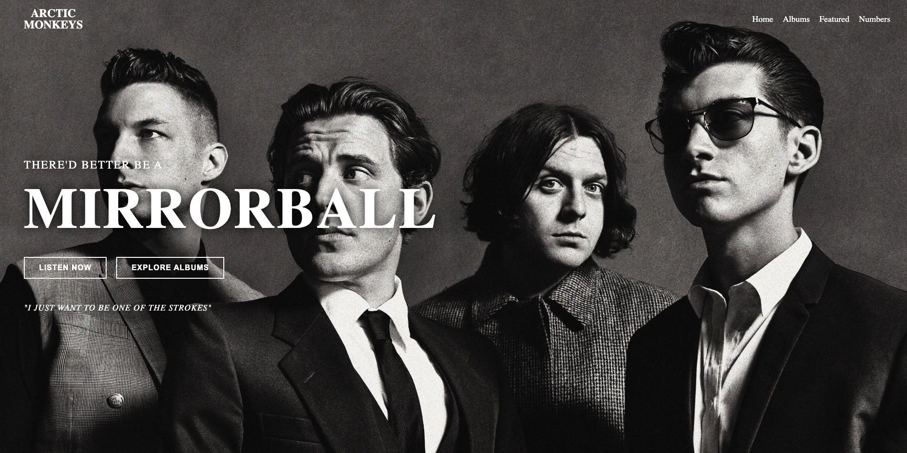

# 🎸🖤  Arctic Monkeys Landing Page (May 16th-17th)

A cinematic Arctic Monkeys inspired landing page built with HTML & CSS.

This project was designed around the dark monochrome aesthetic of the band, combining immersive visuals, album showcases, hover animations, and modern flexbox layouts to create a more atmospheric frontend experience.

Probably my cleanest frontend project so far.

---

## Live Demo

(https://davi-sousa-queiroz.github.io/AM/)

---

## Project Story

After building multiple frontend projects and clones, I wanted to create something that felt more intentional visually instead of just practicing layouts.

I chose Arctic Monkeys because their aesthetic fits perfectly with the kind of cinematic and atmospheric websites I enjoy building:
- dark visuals
- strong typography
- minimal color palettes
- immersive sections
- album-focused presentation

The goal of this project was to push my frontend skills further while keeping the design clean and visually consistent.

This project was built roughly 2–3 weeks into seriously learning HTML & CSS as preparation before moving into backend development and JavaScript later on.

---

## Features

- Fullscreen cinematic hero section
- Interactive navigation bar
- Album showcase cards
- Styled statistics section
- Hover animations and transitions
- Modern flexbox layouts
- Multi-section landing page design
- Atmospheric visual styling

---

## Technologies Used

- HTML5
- CSS3
- Flexbox

---

## Preview 👀

---

## What I Learned

This project helped me improve:
- Flexbox layouts
- Section structuring
- Typography hierarchy
- Hover effects
- Spacing consistency
- Building larger multi-section websites
- Creating stronger visual identity in frontend projects

I also noticed I’m becoming much faster at recognizing layout patterns and building websites without relying heavily on tutorials.

---

## Future Improvements

Possible future additions:
- Responsive mobile layout
- JavaScript interactions
- Music player integration
- Album modal popups
- CSS Grid layouts
- Animated transitions

---

## Note to future self ⏳

One day these projects are gonna look insanely beginner… but this one felt huge at the time.

—--

## Author

Davi Queiroz
